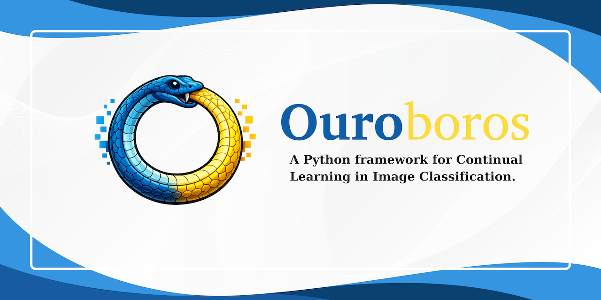

<div align="center">


# Ouroboros - A continual learning framework.

---

<p align="center">
  <a href="#what-is-ouroboros">What is Ouroboros</a> •
  <a href="#key-features">Key Features</a> •
  <a href="#how-to-use">How To Use</a> •
  <a href="src/approach#approaches-1">Approaches</a> •
  <a href="src/datasets#datasets">Datasets</a> •
  <a href="src/networks#networks">Networks</a> •
  <a href="#license">License</a> •
  <a href="#cite">Cite</a>
</p>
</div>

---

## What is Ouroboros
Ouroboros started as code for the paper:
_**Continual learning with pretrained models**_
*Chionas Ioannis*
<!-- TODO: add paper link -->

It was built upon the existing Framework for Analysis of Class-Incremental Learning (FACIL) and was heavily inspired by PyCIL.
It combines the logic of the two frameworks, utilizing Task-Incremental Learning support using FACIL's head management approach and the more
up-to-date PyCIL trainer and config logic. Reproducing the paper's experiments is supported and adding or suggesting new methods is more than welcome.
Expanding and building upon existing work is crucial for the development of science, so feel free to use any part of this framework you find useful.
If you do so, please take the time to cite the framework.

## Key Features
This framework by default supports both task and class-incremental learning due to the list-of-heads FACIL logic.

| Setting                                                                             | task-ID at train time | task-ID at test time | # of tasks |
| ----------------------------------------------------------------------------------- | --------------------- | -------------------- | ---------- |
| [class-incremental learning](https://ieeexplore.ieee.org/abstract/document/9915459) | yes                   | no                   | ≥1         |
| [task-incremental learning](https://ieeexplore.ieee.org/abstract/document/9349197)  | yes                   | yes                  | ≥1         |
| non-incremental supervised learning                                                 | yes                   | yes                  | 1          |

Current available approaches include:
<div align="center">
<p align="center"><b>
  • Finetuning
  • Freezing
  • Joint
  • LwF
  • iCaRL
  • EWC
  • EEIL
  • DMC ( Coming Soon ...)
  • BiC
  • LUCIR
  • SimpleCIL
  • Replay
  • L2P
  • LWF-Dual ( Dual Head Method )
  • Hydra ( Dual Head Method )
</b></p>
</div>

## How To Use
Clone this github repository:
```
git clone https://github.com/yiannischionas/ouroboros.git
cd ouroboros
```

<details>
  <summary>Optionally, create an environment to run the code (click to expand).</summary>

  <!-- TODO: add requirements.txt and environment.yml -->

  ### Using a requirements file
  The library requirements of the code are detailed in [requirements.txt](requirements.txt). You can install them
  using pip with:
  ```
  python3 -m pip install -r requirements.txt
  ```

  ### Using a conda environment
  Development environment based on Conda distribution. All dependencies are in `environment.yml` file.

  #### Create env
  To create a new environment check out the repository and type: 
  ```
  conda env create --file environment.yml --name ouroboros
  ```
  *Notice:* set the appropriate version of your CUDA driver for `cudatoolkit` in `environment.yml`.

  #### Environment activation/deactivation
  ```
  conda activate ouroboros
  conda deactivate
  ```

</details>

To run an experiment, pass a JSON config file:
```
python3 -u src/main_incremental.py --config configs/resnet50_in1k/cifar100/finetuning.json
```
All training parameters (dataset, network, approach, hyperparameters) are defined in the config file.
See the [`src`](./src) folder for more details on approaches, loggers, datasets and networks.

### Scripts
SLURM scripts for all supported backbone/dataset/approach combinations are provided in the [`slurm/`](./slurm) folder.
Each script takes `START_TASK` and `STOP_TASK` environment variables and is designed to be chained by the
[`slurm/general.sh`](./slurm/general.sh) launcher:
```
bash slurm/general.sh slurm/resnet50_in1k/cifar100/finetuning.sh 10
```

## License
Please check the MIT license that is listed in this repository.

## Cite
If you want to cite the framework feel free to use this preprint citation while we await publication:
```bibtex
@article{info
}
```

---

The basis of Ouroboros is made possible thanks to the effort of [Chionas Ioannis](https://github.com/yiannischionas) but most importantly the frameworks that inspired it:
FACIL and PyCIL.
Feel free to contribute or propose new features by opening an issue!
